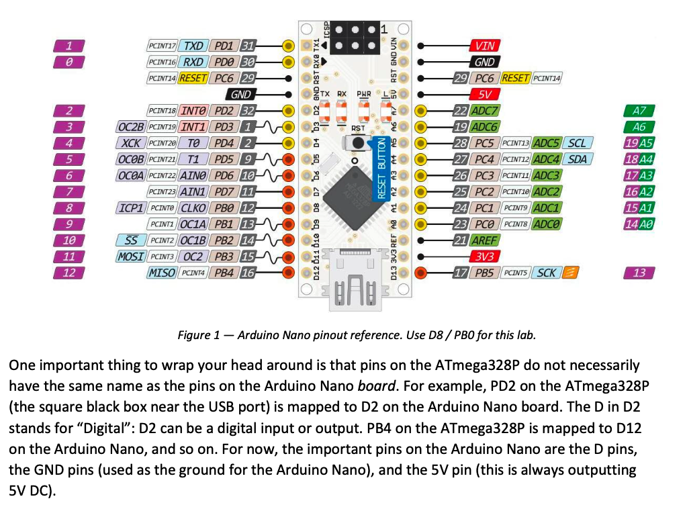

# Microprocessors Lab Workspace

This repository contains the Arduino Nano / ATmega328P lab work for ECED 3204-style AVR exercises.

## Included labs

- [lab1_C](lab1_C/) — C implementation that blinks an LED on Nano D8 (PB0)
- [lab1_ASM](lab1_ASM/) — equivalent AVR assembly implementation
- [lab3_pt2](lab3_pt2/) — AVR C project for the keypad and LED exercise

## Tooling

- Visual Studio Code with the MPLAB Extension Pack
- Microchip XC8 compiler
- Arduino CLI with the Arduino AVR boards core
- Arduino Nano based on the ATmega328P

## Working pattern

Open only one lab folder at a time in VS Code:

- [lab1_C](lab1_C/) for the C version
- [lab1_ASM](lab1_ASM/) for the assembly version
- [lab3_pt2](lab3_pt2/) for the keypad and LED project

Do not open the repository root for the upload task. The MPLAB project files and generated build outputs are inside each lab folder.

## Build and upload

1. Open the lab folder in VS Code.
2. Build with MPLAB CMake: Build or the generated VS Code build task.
3. Confirm the build succeeds and a HEX file is produced in the lab's `out/` directory.
4. Run the global upload task: "Upload MPLAB HEX to Arduino Nano".

The upload task expects the folder to contain the MPLAB project metadata (for example `.vscode/` and `cmake/`) and a valid generated HEX file before uploading. The Arduino CLI path and serial port are machine-specific, so they are configured in the VS Code user task rather than in the repo.

## Actual project layout

```text
lab1_C/
  .vscode/
  cmake/
  _build/
  out/
  main.c
  README.md

lab1_ASM/
  .vscode/
  cmake/
  _build/
  out/
  main.S
  README.md

lab3_pt2/
  .vscode/
  cmake/
  main.c
```

## Hardware note

- Nano D8 maps to ATmega328P PB0
- The LED is wired through a 330 Ω resistor to GND
- The lab uses the ATmega328P device profile in the MPLAB project


